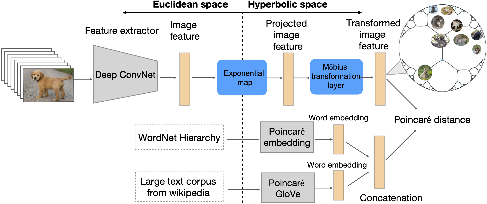

# Hyperbolic ZSL
This is the PyTorch implementation of paper: Hyperbolic Visual Embedding Learning for Zero-Shot Recognition (CVPR 2020)





Tools for computation in Riemannian geometry are not developed by us. One can extend his model to hyperbolic space with these tools. Thanks to these good repos.

* hyrnn can be found in [hyrnn](https://github.com/ferrine/hyrnn)

* geoopt can be found in [geoopt](https://github.com/geoopt/geoopt)

* poincare_glove can be found in [poincare_glove](https://github.com/alex-tifrea/poincare_glove)

* poincare-embeddings can be found in [poincare-embeddings](https://github.com/facebookresearch/poincare-embeddings)

### Using Our Code
```
git clone git@github.com:ShaoTengLiu/Hyperbolic_ZSL.git
cd Hyperbolic_ZSL/code
```
Hyperbolic_ZSL/code is the default root directory.

### Environment Requirements
* [anaconda](https://www.anaconda.com/distribution/) is recommended
* PyTorch version 1.0 or higher
* At least one GPU with adequate memory
* python 3.7 (python 2 may be possible with modifications)

Use environment.yml for quick start

```
conda env create -f environment.yml
```


### Data Preparation
Generate data and put them in these folders:
* ../data/train/img: pretrained feature from ResNet of ImageNet
* ../data/val/img: pretrained feature from ResNet of ImageNet
* ../data/train/label: pretrained word embedding from chosen word model
* ../data/val/label: pretrained word embedding from chosen word model

### Quick Start
One can run our code via

```shell
CUDA_VISIBLE_DEVICES=1 python devise_hype.py \
    --word_model poincare \
    --model_folder model_path \
    --loss_path loss_path \
    --dimension 300
```

* model_path: the folder to save models
* loss_path: the .jpg tp save loss curve

To run DeViSE in Euclidean space via

```shell
CUDA_VISIBLE_DEVICES=2 python devise.py \
    --word_model glove \
    --model_folder model_path \
    --loss_path loss_path \
    --dimension 600
```

**Code refactoring is still continuing**

**Complete version coming soon**